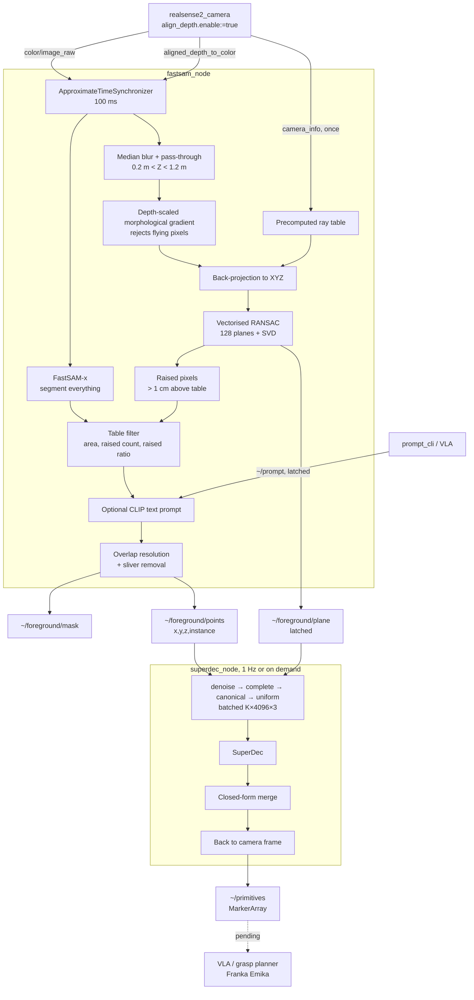

# Thesis project logbook — 3D perception for VLA-driven robotic manipulation

> **Last update**: 2026-10-08

## 1. Project goal

Build a perception module that lets a VLA policy driving a **Franka Emika** arm **understand a tabletop scene and grasp the objects in it**. The robot must answer three questions:

1. **What is on the table?** → separate the objects from the background.
2. **What shape does each object have?** → describe it compactly enough for a planner to reason about.
3. **How do I grasp it / avoid it?** → motion and grasp planning.

### The representation problem

A depth camera returns a **point cloud**: hundreds of thousands of loose $(x, y, z)$ coordinates. That is too raw:

- Heavy (~300,000 points per frame).
- Says nothing about the *shape* of the object.
- Collision checking against 300,000 points makes a trajectory planner very slow.

This thesis uses **superquadrics**: parametric shapes that cover boxes, spheres, cylinders, ellipsoids and every smooth transition between them with **11 parameters**:

| Property | #Params | Meaning |
|---|---|---|
| `scale` | 3 | semi-axes along $x,y,z$ |
| `shape` (exponents) | 2 | how "boxy" or "round" the profile ($\epsilon_1$) and the cross-section ($\epsilon_2$) are |
| `rotation` | 3 (4 as quaternion) | orientation |
| `translation` | 3 | centre position |

A complex object becomes a handful of superquadrics: **300,000 points → ~50 numbers**, with closed-form inside-outside tests for collisions and grasp candidates.

The network used for this conversion is **SuperDec** (ICCV 2025), a pretrained Transformer that takes a full cloud of $N$ points $(x,y,z)$ sampled from a closed *shell* and returns:
1. a $P \times 12$ matrix with the 11 parameters of each of the $P$ predicted superquadrics plus an existence probability $\alpha$;
2. an $N\times P$ point-to-primitive assignment matrix.

### Scope of this document

The path from *"open the camera"* to *"publish one set of superquadrics per object, in the camera frame, inside ROS 2"*.

---

## 2. Progress

### 2.1 Segmentation: from geometry to a hybrid pipeline

#### Step 1 — Geometric background removal (depth + RANSAC)

> *"Keep whatever lies at a reasonable depth AND above the table."*

All the geometric operations live in [bgrem_utils.py](../src/intel_realsense/intel_realsense/bgrem_utils.py) and are shared by every segmentation node.

***I*: Colour/depth synchronisation.** Colour and aligned depth arrive on separate topics; `ApproximateTimeSynchronizer` pairs them within 50 ms (100 ms in `fastsam_node`, whose inference is slower).

***II*: Precomputed rays.** Back-projection needs the intrinsics $(f_x, f_y, c_x, c_y)$:

$$X = \frac{u - c_x}{f_x} \cdot Z, \qquad Y = \frac{v - c_y}{f_y} \cdot Z$$

The $\frac{p - c}{f}$ term never changes, so it is stored once as an `(H, W, 2)` ray table and the `camera_info` subscription is destroyed.

***III*: Depth decoding.** Images are decoded straight from the message buffer (`image_to_array`, no `cv_bridge`) and the depth map goes through a 5×5 median blur before conversion to metres.

***IV*: Pass-through.** $d_{min} < d < d_{max}$ (0.20–1.20 m) removes the far background and zero-depth holes.

***V*: Vectorised RANSAC.** 128 plane hypotheses $n_x x + n_y y + n_z z + d = 0$ are scored at once on 4000 sampled points with one matrix product:

```python
inlier_counts = (np.abs(points @ normals.T + offsets) < threshold).sum(axis=0)
```

The `(4000, 128)` distance matrix replaces a Python loop. It works because **the table is the largest surface in the scene**.

***VI*: SVD refinement.** The winning plane is refit on all its inliers; the last right-singular vector is the direction of least spread, i.e. the normal. The normal is then flipped so that $d > 0$ (oriented towards the camera). `freeze_plane` reuses the first valid plane when the camera is static.

***VII*: Mask.** A point is an object if its signed distance to the plane exceeds `plane_clearance` (1 cm):

```python
above[in_volume] = (points @ normal + offset) > self.plane_clearance
```

#### Step 2 — Instance labelling

`cv.connectedComponentsWithStats` labels the blobs and drops those under `min_blob_area` (300 px). The cloud is published as a `PointCloud2` with a fourth `instance` field (`[x, y, z, instance]`, 16 bytes/point), serialised with `tobytes()`.

#### Step 3 — Flying-pixel rejection

**Problem:** stereo matching interpolates across depth discontinuities, producing "curtains" of points hanging between object and background.

**Why it matters:** SuperDec normalises with `scale = 2 * max|p|`, so **a single outlier 10 cm away shrinks the whole cloud** to ~30% of its size.

**Solution:** a morphological gradient (max − min over a 3×3 window) with a **depth-dependent budget**, because D435 stereo error grows with $z^2$:

```python
high = cv.dilate(np.where(in_volume, depth, 0.0), kernel)
low = cv.erode(np.where(in_volume, depth, 2.0 * max_depth), kernel)
budget = edge_threshold * (depth / edge_reference) ** 2
return in_volume & ((high - low) < budget)
```

- Invalid pixels are pushed to the opposite extreme in each operation, so sensor holes do not read as depth jumps.
- With $\tau = 1$ mm at $z_{ref} = 0.1$ m, the budget is 25 mm at 0.5 m. A fixed millimetre threshold was either too strict far away or too lenient up close.

#### Step 4 — Colour-guided mask refinement (Geometric method only)

Aligned depth is interpolated, so the geometric mask cuts 1–2 px inside the real outline. A hand-written **colour guided filter** (He et al., TPAMI 2013; `cv.ximgproc` is not in this OpenCV build) snaps the mask to the colour edges. Only pixels that are **also geometrically raised** become 3D points, so the refined mask can never leak table points into the cloud.

#### Step 5 — Learned segmentation: U²-Net

The geometric method cannot split **touching objects** (one blob). U²-Net was trained on DUTS-TR and fine-tuned for *objectness* on GraspNet-1Billion (details in [U2NET_SESION.md](U2NET_SESION.md)): IoU 0.911, 99.3% of objects recovered. However, it outputs a **single** saliency mask, so instances are still split by connected components and the touching-objects problem remains. Node kept as `u2net_bgrm.py` for benchmarking only.

#### Step 6 — Hybrid segmentation: FastSAM + table geometry (adopted)

`fastsam_node` ([fastsam_bgrem.py](../src/intel_realsense/intel_realsense/fastsam_bgrem.py)) combines a class-agnostic instance segmenter with the RANSAC table:

1. **FastSAM** (YOLOv8-seg backbone, "segment everything") produces candidate masks.
2. **Geometric filter**: a mask is kept only if
   - its area is < 30% of the image (`max_mask_ratio`; larger ones are table/background),
   - it has ≥ `min_blob_area` raised pixels,
   - more than 50% of its valid depth is above the table (`min_above_ratio`).
3. **Optional text prompt** (CLIP ranking) applied *after* the filter, so CLIP only ranks plausible objects. Comma-separated terms; changeable at runtime via `ros2 param set`, the `~/prompt` topic, or the `t` key in the OpenCV window (`c` clears it).
4. **Overlap resolution**: masks are painted largest first so nested (smaller) masks win; labels are intersected with the raised pixels and slivers < `min_blob_area` are dropped.

#### Step 7 — Segmentation benchmark

The script [eval_segmentation.py](../scripts/eval_segmentation.py) evaluates every method on GraspNet-1Billion (RealSense, scenes 90–99, 320 frames, 640×480) with UOIS metrics, point-cloud quality and the final superquadric error. Definitions and results can be found in [SQ_METRICS.md](metrics_sq/SQ_METRICS.md).

**Conclusions:**

- **FastSAM solves touching objects**: under-segmentation drops from 1.40 to 0.02 merged blobs per frame, and usable objects (%F ≥ 0.75) go from 25% to 62%.
- **Outliers drop 13×** (0.290 → 0.022), which directly protects SuperDec's max-based normalisation.
- The geometric method keeps the best **completeness** (0.908) and costs no GPU, but merges objects.
- **FastSAM-x is the default**: best quality on every segmentation metric and the lowest superquadric error. FastSAM-s is the fallback when GPU budget is tight (2.3× faster, 2.6× less VRAM, +2.5 mm error).

### 2.2 Shape abstraction: SuperDec

#### Step 8 — Building SuperDec against torch 2.14

Importing SuperDec JIT-compiles the PVCNN CUDA extension. It failed until nvcc matched the torch CUDA runtime exactly and C++20 was enabled (see §5).

#### Step 9 — Offline validation and preprocessing

[superdec_offline.py](../scripts/superdec_offline.py) runs the `normalized` checkpoint on captured `.ply` clouds, with switches to measure each preprocessing step. All preprocessing now lives in [superdec_utils.py](../src/intel_realsense/intel_realsense/superdec_utils.py), so the bench and the ROS node run **the same code path**.

| Switch | What it does | Why |
|---|---|---|
| `--denoise` | Statistical outlier removal (20 neighbours, 2σ) | One outlier corrupts the normalisation |
| `--canonical` | Rotates the table normal to $+Y$ | Matches ShapeNet's y-up prior |
| `--complete` | Closes the single-view shell with the table as floor | SuperDec was trained on closed mesh surfaces |
| `--uniform` | Voxel downsample with binary-searched voxel size (~1.3 × 4096 points) | Equalises density between real and synthetic surfaces |
| `--merge` | Closed-form primitive merging (Step 11) | Removes stacked/redundant primitives |

**Metric correction.** "Fewer primitives = better" proved a **defective proxy**: visual inspection in viser showed flat slabs glued to the visible face. It was replaced by:

$$\text{flatness} = \text{mean}\left(\frac{\text{min edge}}{\text{max edge}}\right)$$

and, finally, by the **Solina-Bajcsy radial distance** from the cloud to the closest primitive (evaluated in log space to avoid overflow), which is the honest quality measure used everywhere now.

**`--complete` (closed shell).** On a 64×64 height map over the plane: a floor point per occupied cell (30% of the input count) and walls along the silhouette border (60%), with **continuous** random heights and in-cell jitter. The first version used 12 fixed wall heights and produced ziggurat-like stacks, one slab per ring.

**Results on the real 3-object scene (radial error):**

| Configuration | obj01 (aluminium profile) | obj02 (cube) | obj03 (cylinder) |
|---|---|---|---|
| `--canonical --denoise` | 8.66 mm | 5.83 mm | 5.84 mm |
| **`+ --complete --uniform`** | **7.05 mm** | **2.82 mm** | **2.42 mm** |

`--lm` (SuperDec's Levenberg-Marquardt refinement) gave no measurable gain (flatness 0.401 → 0.404) and is not used. `--extrude` (solid fill) was superseded by `--complete`.

#### Step 10 — Box bias refinement

**Finding.** SuperDec assigns the same cross-section exponent to a cube (`eps_sect` 0.288) and a cylinder (0.294). Its training categories (table, car, chair, airplane, sofa, …) are dominated by flat faces and contain no cylindrical containers: a **domain gap**.

**Decisive experiment.** Fitting a **single** superquadric to the raw cloud, initialised with PCA:

| Object | `eps_prof` | `eps_sect` | Reading |
|---|---|---|---|
| obj02 (cube) | 0.413 | **0.220** | box ✓ |
| obj03 (cylinder) | 0.125 | **0.882** | round section ✓ |

The objective separates cube from cylinder; **the bias is in the network**, which empirically justifies **fine-tuning SuperDec** as a thesis contribution.

#### Step 11 — Closed-form primitive merging (adopted)

Key observation: **9 of the 11 parameters have a closed-form estimate**. For a group of points, the centroid gives the translation, the PCA eigenvectors give the rotation and the per-axis maximum gives the extents. Only the two exponents and a global shrink factor need searching.

`fit_groups` evaluates, for all groups in one batched kernel:
- 3 shrink factors × 5 × 5 exponent pairs in $[0.1, 1.9]$,
- × 3 axis permutations, because a squat cylinder has two near-equal radial variances and `eigh` may put the symmetry axis inside the cross-section, where a box *is* the better fit.

`merge_object` then runs a greedy search over SuperDec's point-to-primitive assignment (kept as is, since that part the network does well):

```python
ratio = cand / max(residual[a], residual[b])   # relative: object size cancels out
if ratio.min() > tol: break                     # tol = 1.15
```

Each round fits **all pairs in one call** and accepts only the best merge. The surviving groups are refit on a finer 13×13 grid with up to 768 points each.

| | Retired Adam refinement | Closed-form merge |
|---|---|---|
| Cost per candidate | 300 Adam iterations × 3 seeds | 1 `eigh` + grid lookup |
| Parallelism | Python loop | one kernel per round |
| Time (3 objects) | 56 s | **0.13 s** |

**Adopted configuration** (defaults of `SuperDecRunner` and of the launch file):

```bash
python scripts/superdec_offline.py --canonical --denoise --complete --uniform --merge
```

### 2.3 ROS 2 integration

#### Step 12 — `superdec_node`

[superdec_node.py](../src/intel_realsense/intel_realsense/superdec_node.py) turns the instance cloud into superquadrics:

- **Separate node**: loading torch/CUDA and running inference would stall the 30 Hz segmentation callback.
- **Inputs**: `/fastsam_node/foreground/points` and the table plane on `/fastsam_node/foreground/plane`, published **latched** (`TRANSIENT_LOCAL`) as `[nx, ny, nz, d]` so the node gets it even if it starts late.
- **Batching**: every instance with ≥ 512 points (up to 8) is resampled to `(4096, 3)` and stacked into `(K, 4096, 3)` for **one** forward pass.
- **Output frame**: the canonical rotation and normalisation are undone, so primitives land back in the camera frame.
- **Triggering**: a 1 Hz timer plus an on-demand `~/decompose` service. Inputs use a reentrant callback group and the work a mutually exclusive one, under a `MultiThreadedExecutor`, so new clouds keep arriving while inference runs. A failed frame is logged without killing the node.
- **Visualisation**: `MarkerArray` on `~/primitives`, one `TRIANGLE_LIST` per primitive (12 × 24 parametric grid shared by all primitives), a `DELETEALL` first, and golden-angle colours per instance.

#### Step 13 — Launch file

[sq_launch.py](../src/intel_realsense/launch/sq_launch.py) starts `fastsam_node` and `superdec_node` with all the arguments exposed.

#### Step 14 — Headless prompting: `prompt_cli`

Prompting used to require the OpenCV window (`t` key) and a dedicated `gnome-terminal`, since `ros2 launch` does not forward stdin. [prompt_cli.py](../src/intel_realsense/intel_realsense/prompt_cli.py) decouples it:

- **Separate node** run with `ros2 run intel_realsense prompt_cli` in any terminal; works with `show_window:=false`.
- **Keys**: `t` types a comma-separated prompt, `c` segments everything, `q` quits. Piped stdin publishes one prompt per line (`echo "cup, bowl" | ros2 run …`).
- **Interface**: `std_msgs/String` on `/fastsam_node/prompt`, latched (`TRANSIENT_LOCAL`, depth 1) on both ends so a late `fastsam_node` still gets the last prompt.
- `fastsam_node` no longer blocks on `input()`; the window keeps only `q` (quit) and `s` (save). The `gnome-terminal` prefix was removed from the launch file.
- The topic is the entry point for a future VLA module that decomposes complex instructions into FastSAM prompts without pausing segmentation.

---

## 3. Current architecture

### Data flow



### `fastsam_node` interface

| Topic / service | Type | Content |
|---|---|---|
| `~/foreground/mask` (pub) | `sensor_msgs/Image` (mono8) | Binary object mask |
| `~/foreground/points` (pub) | `sensor_msgs/PointCloud2` | `x, y, z, instance` |
| `~/foreground/plane` (pub, latched) | `std_msgs/Float64MultiArray` | `[nx, ny, nz, d]` |
| `~/prompt` (sub, latched) | `std_msgs/String` | Comma-separated text prompt (from `prompt_cli` or the VLA) |
 
### `superdec_node` interface

| Topic / service | Type | Content |
|---|---|---|
| `~/primitives` (pub) | `visualization_msgs/MarkerArray` | One mesh per superquadric |
| `~/decompose` (srv) | `std_srvs/Trigger` | Run SuperDec on the latest cloud |

---

## 4. Design rationale

### Why a hybrid segmentation instead of pure geometry or a pure DL?

| | Depth + RANSAC | FastSAM alone | **FastSAM + table geometry** |
|---|---|---|---|
| Touching objects | Merged | Split | **Split** |
| Table / background masks | Never | Frequent | **Filtered out** |
| Floating outliers in 3D | Many (0.290) | — | **Few (0.022)** |
| Unknown objects | Fine | Fine (class-agnostic) | **Fine** |
| GPU | None | ~400 MB | ~400 MB |

The network answers *"which pixels belong together"*; the geometry answers *"is this an object on the table"* and provides the plane SuperDec needs downstream. Neither alone does both.

### Why not use the RealSense point-cloud topic?

| Data | Per frame | At 30 Hz |
|---|---|---|
| Depth `16UC1` 640×480 | 0.6 MB | 18 MB/s |
| `PointCloud2` XYZRGB | 6.1 MB | **184 MB/s** |

Besides 10× the DDS bandwidth, the unordered cloud loses the 2D grid, and with it morphology, the guided filter, mask–depth intersection and the image-space segmenter. The node back-projects locally only the pixels that survive the filters.

### Why the canonical frame matters

SuperDec was trained on ShapeNet, where objects stand upright with $+Y$ up. The cloud arrives in the camera optical frame (Y down, tilted), so for the network the objects lie in an impossible pose. **The RANSAC normal already is "up"**: the same plane removes the background, defines the canonical frame, and provides the floor for `--complete`. Measured: obj03 went from 9 to 5 primitives with `--canonical` alone.

### Why closed-form merging instead of gradient refinement?

For a perception module feeding a planner, latency dominates. The Adam refinement was 2× more accurate but 400× slower than the closed-form merge. The closed form keeps the PCA-seeded, permutation-aware fit that fixed the cylinder case and pays only for a grid of 225 candidates per group.

### Why hand-written serialisation?

`point_cloud2.create_cloud` changes signature across ROS distros and iterates in Python; `tobytes()` is deterministic and ~50× faster. Decoding images from the raw buffer (`image_to_array`, honouring `step` padding and endianness) removes the `cv_bridge` dependency.

---

## 5. Other solved challenges

### SuperDec did not build against torch 2.14

`superdec/functional/backend.py` JIT-compiles the PVCNN CUDA extension at import time; the `StackedPVConv` point encoder makes it unavoidable.

| # | Finding |
|---|---|
| 1 | With `-std=c++17`, a **torch** header failed: torch 2.14 requires C++20 |
| 2 | With `-std=c++20`, **nvcc 12.0** died in GCC 12's `type_traits` |
| 3 | nvcc 13.4 → *"CUDA compiler and CUDA toolkit headers are incompatible"* |
| 4 | **Key:** `cccl` requires nvcc to match the `CUDART_VERSION` shipped with torch exactly. torch cu130 → nvcc **13.0.x** |

```bash
pip install "nvidia-cuda-nvcc==13.0.88" "nvidia-cuda-crt==13.0.88" \
            "nvidia-nvvm==13.0.88" "nvidia-cuda-cccl==13.0.85"
```

Plus `-std=c++20` for host and device, and `g++-13`. Two traps:

1. `torch.utils.cpp_extension` resolves `CUDA_HOME` **once, at import**; environment variables must be set before it.
2. `os.path.dirname(os.__file__)` points to the system stdlib, not the venv; use `sysconfig.get_paths()['purelib']`.

> ⚠️ The patch lives inside the SuperDec clone. A `git pull` there removes it.


---

## 6. Open challenges

### A — Partial clouds (mitigated, not solved)

SuperDec expects closed shells; a single view gives only the visible face. `--complete` assumes a vertical prism over the silhouette, which fails for concave objects, handles and overhangs.

**Possible solution: multi-view TSDF fusion** (`open3d.pipelines.integration.ScalableTSDFVolume`). It is the only option that adds **real observations** instead of better-phrased assumptions:

| Problem | How TSDF addresses it |
|---|---|
| Partial cloud | Observes the hidden faces |
| Synthetic walls | `--complete` no longer needed |
| Box bias | A full cylinder has an *observed* circular section |
| Flying pixels | Edge artefacts are inconsistent across views and average out |

**Prerequisite:** a calibrated TF between the camera and a fixed frame (e.g. hand-eye calibration on the Franka).

### B — Box bias of SuperDec

Without per-primitive refinement, cube and cylinder still receive similar `eps_sect`. The Step 10 experiment justifies **fine-tuning SuperDec on partial, tabletop-like clouds** (e.g. GraspNet object meshes) as the root-cause fix.

### C — Segmentation quality ceiling

Even FastSAM-x yields only 62% of objects with F ≥ 0.75 and 0.84 completeness. Low completeness means cropped objects (e.g. `plane_clearance` cutting the base), which SuperDec turns into wrong extents.


### D — Integration with the VLA

Primitives are only published as `MarkerArray` for RViz. A typed message (per instance: scale, exponents, pose) and a fixed robot base frame are needed before the VLA or a grasp planner can consume them.

---

## 7. Task status

| Task | Status |
|---|---|
| Geometric background removal (depth + RANSAC) | ✅ |
| Depth-scaled flying-pixel rejection | ✅ |
| Colour-guided mask refinement | ✅ |
| U²-Net training and fine-tuning (GraspNet) | ✅ (benchmark only) |
| FastSAM + table-geometry segmentation | ✅ adopted |
| Segmentation benchmark on GraspNet-1Billion | ✅ |
| Touching objects | ✅ solved by FastSAM |
| SuperDec build against torch 2.14 | ✅ |
| Offline SuperDec bench + radial-error metric | ✅ |
| Adam refinement of primitives | ⚠️ implemented and retired (56 s) |
| Closed-form primitive merging | ✅ (0.13 s) |
| `superdec_node` with batching and markers | ✅ |
| Launch file `sq_launch.py` | ✅ |
| Headless prompting (`prompt_cli`) | ✅ |
| Multi-view TSDF fusion | ⬜ next |
| SuperDec fine-tuning | ⬜ pending |
| Typed superquadric message + robot-frame TF | ⬜ pending |
| Grasp planning / VLA integration | ⬜ pending |

---
